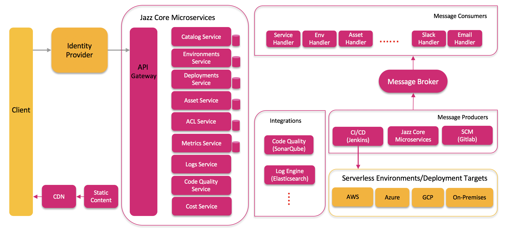

#  Jazz Serverless Development Platform

**Seamlessly build, deploy & manage cloud-native serverless applications!**

## Introduction

Jazz, a serverless development platform, accelerates adoption of serverless technology within your enterprise. Jazz comes with a beautiful UI that lets developers quickly create serverless applications with a click of a button. Its modular design makes it easy to add new integrations that your enteprise needs.

## Overview

* **Services** - As of today, Jazz can help build functions, APIs and static websites. Fully customizable template-based design makes it easy for admins to define new ones and expose them as services to the developers. Support for [AWS SAM](https://github.com/awslabs/serverless-application-model) & [Serverless Framework](https://github.com/serverless/serverless) templates will be coming soon - this will allow developers to define their serverless applicatinos using these commonly used frameworks!
* **Deployment Targets** - Currently, Jazz can deploy to AWS serverless services including Lambda, API Gateway, S3, CloudFront, DynamoDB, SQS, Kinesis etc. We plan to support related services in Azure and GCP in the near future.
* **CI/CD** - Jazz comes with CI/CD by default. It creates a code repository for each service, assigns appropriate permissions and adds a web hook to trigger build/deployment workflows whenever it sees a commit. We leverage [Jenkins](https://github.com/jenkinsci/jenkins) open source for build process and [Serverless Framework](http://www.serverless.com) for deploying these services.
* **One-Click Development Environments** - Jazz automatically creates a new dedicated development environment for each git branch in the service repository. This allows parallel development in a multi-developer team without a hitch! Jazz takes care of deleting these environments once the branch gets deleted.
* **Extensions** - Jazz is designed to integrate and work well with other systems that your enterprise needs. You can check out our optional extensions like Slack, Splunk, Apigee etc. Centralized configuration helps Jazz admins to easily enable/disable these features as per their needs.
* **Multiple Accounts & Regions** - Jazz's multi account/region extension allows you to add support for multiple accounts & regions to an existing Jazz stack. Developers can simply select the target account & region from the UI to deploy their services. Admins can add/remove new accounts/regions to the stack with ease.
* **Other Features** - Jazz comes with many useful integrations like SCM (Gitlab/Bitbucket), monitoring (CloudWatch), logging (ElasticSearch), authentication (Cognito), access controls, code quality metrics (SonarQube) by default.

Jazz is [open-sourced](http://opensource.t-mobile.com) and under active development by T-Mobile's Cloud Center of Excellence.

[Watch the video preview here.](https://www.youtube.com/watch?v=6Kp1yxMjn1k)

## User Guide

For complete user guide, see our [wiki](https://github.com/tmobile/jazz/wiki).

## Architecture

Following is the high level logical architecture of Jazz.

## Installation

You can [install Jazz](https://github.com/tmobile/jazz-installer) in your AWS account using the automated installer.

## Try Jazz!

You can try out public preview version of Jazz by registering with your email address [here](http://try.tmo-jazz.net). You will need a registration code which can be requested by joining [slack](https://tmo-oss-getinvite.herokuapp.com/).

## Platform Development

### Branching/Release Strategy

1. Breaking/nontrivial features first go into named feature branches cut from `develop`
2. When/if a feature branch is chosen to be included in the next release, it is merged into `develop`
3. Release testing happens in `develop`
4. When confirmed/vetted, `develop` is merged into `master`, and `master` becomes the current release.
5. Small fixes explicitly intended for the next release can be PRed directly into `develop` without first needing a feature branch.

tl;dr `master` is always the current release, `develop` is always the current state of the next release. If you want to contribute a PR, we recommend you fork and work in a branch off of `develop`, then PR against `develop`. Project owners will move you into a feature branch if they deem it necessary.

## License

Jazz is released under the [Apache 2.0 License](https://github.com/tmobile/jazz/blob/master/LICENSE)
